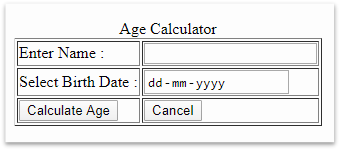

# Age Calculator

A leading company provides online portal for customer needs. The Portal has various services, in that one of the services is Age Calculator. Customer can provide details as per the requirement, after clicking calculate Age button customer can view the age information on the same page.

Sample index.jsp for displaying the page content.

All the labels are created as per the above page.The following table provides the more information about the above image.

| Field Name | Field Type | Component ID | Rule | Description |
| ---------- | ---------- | ------------ | ---- | ----------- |
|  | `<caption>` | heading | Age Calculator | 
| form | `<form>` | form(should be name and not id) |
| name | Textbox | name | Required, Name must Start with Uppercase letter | This field holds the customer name | 
| dob | date | dob | required | This field holds the date of birth | 
| CalculateAge | Submit | calculateAge (should be name and not id) |  | When this button is clicked, the URL that has to be executed is / AgeCalulator which is the declared in the action attribute of `<form>` tag. The type of the http method is GET. This URL has to be mapped to AgeCalulator servlet class | 
| Cancel | reset |  |  | This button is used to reset the data | 

Sample index.jsp for displaying the age information result. Use expression language to print the name and message into this page.

## Requirement 1:

**Class Name** : AgeCalculator is a servlet class.

**Package**: com.cognizant

This class provides the methods doGet() for processing HttpServletRequest and HttServletResponse. This doGet method reads input parameter name and date of birth values.  It invokes AgeService method with date of birth input and it returns the String message. Set name and message in request scope. Use request dispatcher to dispatch the control to the index.jsp.

| Method Name | Method Argument name:type | Return type | Description | 
| ----------- | ------------------------- | ----------- | ----------- |
| doGet() | HttpServletRequest,HttpServletResponse | void | This method receive request parameter values and  dispatch the control to the index.jsp |

