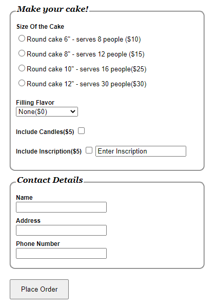
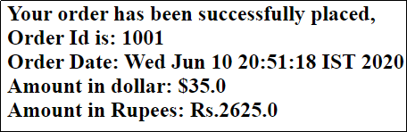
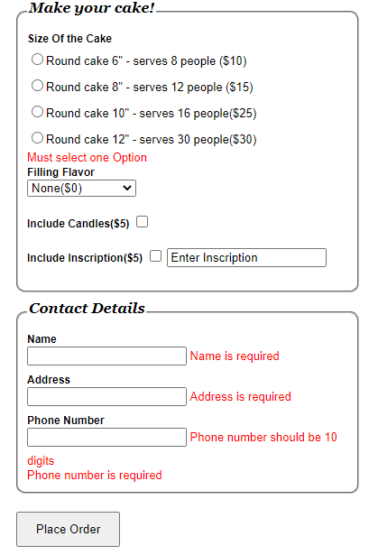

# BakingoCakeService

“A party without any cake is just a meeting” is a popular saying. No celebration is complete without a piece of cake. It brings happiness is the best reminder of all the joys of life. Want to have the cake and eat it too? 

So Client decide to provide service to customer, client need web application (Bakingo Cake Service) to allow customer can place the order. Using this application now customer can treat themself and their loved ones to instant happiness with just a click. 

The customer provides the order details that should be stored into a collection and customer can view the status of the order status along with the bill amount. 

The Bakingo Cake Service web application aims at the following features 

1.Place the order by providing order details.
2.View the order status along with bill amount after successful order.

## Data Design

This project currently does not connect with the DB server and therefore uses the in-memory storage using java collections (HashMap) to perform read/write operations related to the scope of the application.

## Component Design 

**Component name**: src/main/webapp/WEB-INF/views/placeOrder.jsp

**Description**: This JSP is used by the user to place the order. The URL for this page is /showCakeOrderForm which has to be launched from the browser’s address bar which means that it is a HTTP GET request. The page looks something similar to the image shown below.

| Field Name | Field Type |	Component ID | Description | 
| ---------- | ---------- | ------------ | ----------- |
| Form | `<form>` |	form(should be name and not id) | Already provided. |
| selectedcake | radiobutton | selectedcake1 selectedcake2 selectedcake3 selectedcake4 | Create 4 radiobuttons with path name selectedcake but id and value should different. Value mention as per label instruction 10, 15, 25 and 30 respectively. | 
| flavor | Drop down | flavor | This field lists the entire filling flavor types into drop down list. User can select their flavor types from the dropdown list. |
| includecandles | Checkbox | includecandles | This is checkbox field value should be 5. |
| includeinscription | Checkbox | includeinscription | This is checkbox field value should be 5. |
| theinscription | Textbox | theinscription | This field holds the Wishes message | 
| name | Textbox | name | This field holds the customer name | 
| address | Textbox	address	This field holds the customer address | 
| phoneNumber | Textbox | phoneNumber | This field holds the phone number | 
| Pleace Order | Submit | submit | When this button is clicked, the URL that has to be executed is  /orderStatus which is the declared in the action attribute of `<form>`  tag. The type of the http method is GET. This URL has to be mapped to `getOrderStatus(@Valid @ModelAttribute("cake") Cake cake,BindingResult result,ModelMap map)` method of the CakeController class | 

**Note**: The values in the Filling Flavor drop-down must be auto populated from the controller with the values as given in the below table. They should not be populated/hardcoded inside the JSP.

| Filling Flavor type | 
| ------------------- |
| None($0) | 
| Custard($5) |
| Raspberry($10) | 
| Pineapple($5) | 
| Cherry($6) |
| Apricot($8) |
| Buttercream($7) |
| Chocolate($10) | 

**Component Name**: src/main/webapp/WEB-INF/views/orderStatus.jsp

**Description**: This page displays order confirmation status, when all the details entered are added to collection successfully, it should print the message following message. It should print the message in h2 tag. And h2 tag id should be **“status”**

## Business Validation for Component 

| Rule | Error Message (If validation fails) | 
| ---- | ----------------------------------- |
| Name field is  mandatory | Name is required
| phoneNumber | Phone number should be 10 digits |
| phoneNumber field is mandatory | Phone number is required | 
| Address field is mandatory | Address is required | 
| Selectedcake(use NotNull annotation) | Must select one Option |

## Technical Requirements:

**Class name**:  Cake

**Package**:   com.cognizant.bakingo.bean

The Cake is a model class and is used to contain the details of the Cake

| Attributes | Method | 
| ---------- | ------ |
| selectedcake: Integer flavor: String flavorRate: Integer includeCandles: Integer includeinscription: Integer theinscription: String name: String phonenumber: String price: double | getter/setter | 

**Class name**:  CakeService is a service class containing following members

**Package**:  com.cognizant.bakingo.service

In this class constructor adds the data into flavorType attribute. The following table provides flaovor type and rate value information here. 

| Filling Flavor type | Rate Value | 
| ------------------- | ---------- |
| None($0) | 0 |
| Custard($5) | 5  |
| Raspberry($10) | 10 | 
| Pineapple($5) | 5 | 
| Cherry($6) | 6 |
| Apricot($8) | 8 |
| Buttercream($7) | 7 |
| Chocolate($10) | 10 |

| variable Name | Data type | Responsibilities |
| orderList | `Map<Integer,Cake>` | This static attribute initialize with new HashMap() |
| flavorList | `Map<String,Integer>` | This static attribute initialize with new LinkedHashMap() |
| orderId | int | This is static attribute initialize with 1000 | 

This class provides addOrder method which is used add the data into in the collection.

| Method Name | Input Parameters | Output Parameters | Description |
| addOrder | cake:Cake | int | This method pre increment orderId. Add the cake Object into orderList and return the orderId. | 

**Class name**:  CakeController is a controller class.

**Package**:   com.cognizant.bakingocontroller

This class provides the methods for processing various kinds of HTTP requests such as displaying a showCakeOrderForm where user can input the. This class also provides the request processing methods for getOrderStatus and displaying the order status.

> UserController

| Attribute Name | Attribute Type | Access Specifier | Constraints |
| -------------- | -------------- | ---------------- | ----------- |
| cakeService | CakeService class | Private	Use annotation to autowire |

| Method Name | Method Argument name: type | Return type | RequestMapping URL & request method | Description | 
| ------------ | ------------------------- | ----------- | ----------------------------------- | ----------- |
| showCakeOrderForm | `@ModelAttribute("cake") Cake cake` | String | /showCakeOrderForm & GET | This method shows Place Order in the browser. |
| getOrderStatus | `@Valid @ModelAttribute("cake") Cake cake,BindingResult result,ModelMap map` | String | /orderStatus & GET | Description added below of the table | 
| flavorList | `Set<String>` | Should be annotated with ModelAttribute with name “flavorList” | Using cakeService. cakeService.flavorList  get All Key values and add to the flavorList return the flavorList  set | 

**Description for getOrderStatus() method**:

This method receives cake object as parameter.

Return page “placeOrder” if it has any errors.

Otherwise  if the flavor type is present in cakeService.falvorList, get the falvoutRate and set into the local integer variable flavorRate then calculate price value using below formula.

    double price= getSelectedcake value+flavorRate+ getIncludeCandles value +getIncludeinscription values;

Then cake.setPrice(price) value

Calculate indian rupees value using below formula

	double indianPrice=cake.getPrice()*75.0;

then invoke the cake service addOrder method with cake object assign the return value to local orderId variable.

add the following Object values into map object.

"cake","indianPrice" and "orderId”

Check orderId>=1000 return page name is “orderStatus” else return page name “placeOrder”.
