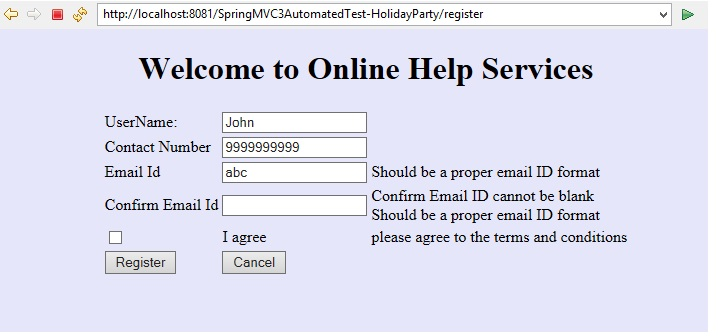
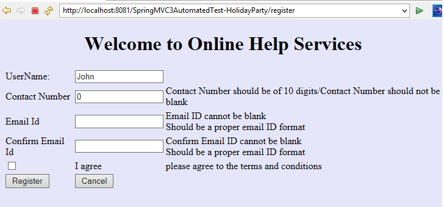
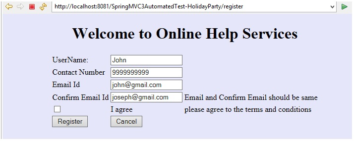
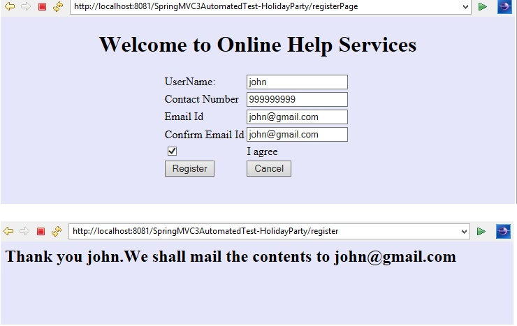

# HolidayParty-Validations

Holiday Party

Create a Spring MVC Spring Boot Web Application for developing the Online Registration for Holiday Party. Design a Registration Page called registrationpage.jsp to enter the userName, Contact number,Email ID, confirm email ID and check box to agree on terms and Conditions. On submitting Register, the application should validate whether the user has entered all the details. If the details entered are correct then the user has to  be redirected to thankyou.jsp page that displays the message “ Thank you “+<username>”.We shall mail the contents to+”<emailId>”.If the details entered are invalid then redirect the user to the same page registrationpage.jsp with the appropriate error message”.

**Note**:

- Create a controller class called RegistrationController.
- Create a class called RegistrationBean with  attributes userName,contactNumber,emailId,confirmEmailId,status.  Generate necessary getters and setters .
- Create a class called CustomValidator that should perform the below Validations
- status should be checked by the user.
- contactNumber should be of 10 digits.
- emailId and confirmEmailId should be same.
- If any of the above condition is failed then appropriate error message should be displayed(look for the screen shots for the error messages)
- CustomValidator should be autowired inside the RegistrationController.
- Initially,the user should be routed via the request mapping registerPage in RegistrationController to registrationpage.jsp that allows the user to register for the party.
- On clicking the Register button, the RegistrationController's performRegistration  method should be called . This method takes two arguments -  model attribute named “register” which holds the form populated RegisterationBean Object and  the BindingResult.
- This method should check whether the user details are valid by invoking the  CustomValidator.
- If the details entered are valid then redirect the user to thankyou.jsp page  that displays the message “Thank you “+<username>”.We shall mail the contents to”+<emailId>”.
- If the details entered are invalid then redirect the user to the same registrationpage.jsp with the appropriate error message

## Design Contraints:

### UI design Contraints

> registrationpage.jsp

| Component | ID | 
| --------- | --- |
| Textbox | userName | 
| Textbox | contactNumber |
| Textbox | emailId | 
| Textbox | confirmEmailId | 
| Checkbox | status |
| Submit | submit(name) |

> thankyou.jsp

**The Result has to be rendered in the `<h2>` tag**

> Controller

**RegistrationController**               

| AttributeName | AttributeType | Access Specifier | Constraints |
| ------------- | ------------- | ---------------- | ----------- |
| custValidator | CustomValidator | private | Use annotation to Autowire | 

| Method Name | Method Argument name:type | Return type | RequestMapping URL | Method |
| ----------- | ------------------------- | ----------- | ------------------ | ------ | 
| registerPage | modelAttribute “register”: RegistrationBean,result:BindingResult | String | /registerPage | GET | 
| performRegistration | modelAttribute “register”: RegistrationBean,model:ModelMap,result:BindingResult | String | /register | POST | 

*Note*:

RegistrationController should be inside the package com.controller

Should use annotation to autowire RegistrationController as Controller      

> Validator

**CustomValidator**

| Method Name | Method Argument name:type | Return type | 
| ----------- | ------------------------- | ----------- |
| validate | arg0:Object,arg1:Errors | void | 

*Note*:

CustomValidator should be inside the package com.validate

Should use annotation to autowire  CustomValidator.

> Model

**RegistrationBean**

| AttributeName | AttributeType | 
| ------------- | ------------- |
| userName | String | 
| contactNumber | long |
| emailId | String | 
| confirmEmailId | String | 
| status | boolean |

*Note*:

Should be in the package com.model
