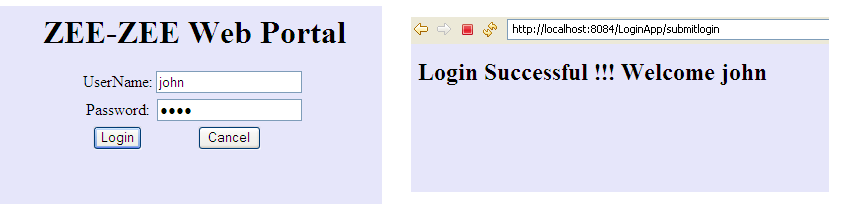
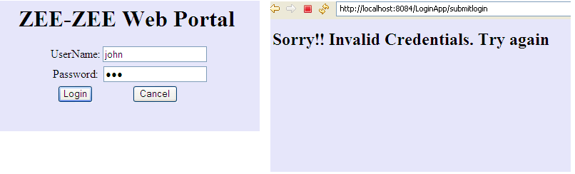

ZeeZeeLogin

ZEE-ZEE Web Portal - Authentication

Create a Spring MVC Spring Boot Web Application for checking the User Credentials of Zee-Zee Web Portal. Design a Login Page to accept username and password from the User. On clicking Login, the application should check whether the username and password is valid. Authentication is successful if the username is same as the password. If the Authentication is successful redirect the user to success.jsp page that displays the message " Login Successful !!! Welcome”+<userName > otherwise redirect the user to invalid.jsp page to display the message "Sorry!! Invalid Credentials. Try again ".

<u>*Application Work Flow*</u>

- Create a controller class called LoginController.
- Create a class called LoginBean with two attributes userName and password.Generate necessary getters and setters .
- Create a LoginService which has a method called validate that takes LoginBean as its argument and returns boolean.It returns true if the userName and password is equal otherwise return false. 
- LoginService should be autowired inside the LoginController.
The user should be routed via the LoginController's Request mapping /login GET request above showLoginpage method to login.jsp that allows user to enter the username and password. 
- Upon entering the userName and password and clicking the Login button, the LoginController's checkLoginDetails  method should be called . This method takes two arguments -  model attribute named “login” which holds the form populated LoginBean Object and the BindingResult.

1. This method should check whether username is same as the password by invoking the validate method of the LoginService.
2. If it is valid then redirect the user to success.jsp page with a message "Login Successful!!! Welcome”+<userName > otherwise redirect the user to invalid.jsp page that displays the message "Sorry!! Invalid Credentials. Try again".

## Note:

Partial code is given to do the above task.

Do not change the attributename/methodname/classname in the partial code provided. 

You can include any new attributes/methods in the partial code.

### Screen Designs and Expected Output:

> Success Flow

> Failure Flow

## Design Constraints:

> login.jsp

| Component | Name | Constraints | 
| --------- | ---- | ----------- |
| textbox | userName | - | 
| password | password | - | 
| submit | submit | - | 

> success.jsp

- The Result has to be rendered in the `<h2>` tag

> failure.jsp

- The Result has to be rendered in the `<h2>` tag

> **Controller** (Class name : LoginController (should be inside the package com.controller))
         
| AttributeName | AttributeType | Access Specifier | Constraints | 
| ------------- | ------------- | ---------------- | ----------- |
| service | LoginService | Private | Use annotation to Autowire | 

| Method Name | Method Argument name:type | Return type | RequestMapping URL |
| ----------- | ------------------------- | ----------- | ------------------ |
| showLoginpage | modelAttribute “login”: LoginBean | String | /login |
| checkLoginDetails | modelAttribute “login”: LoginBean,result:BindingResult | String | /submitlogin |

> **Service** (Class name: LoginService(should be inside the package com.service) )

| Method Name | Method Argument name:type | Return type | 
| ----------- | ------------------------- | ----------- |
| validate | bean:LoginBean | boolean |

> **Model** (Class Name :LoginBean(should be inside the package com.bean))

| AttributeName | AttributeType | 
| ------------- | ------------- |
| userName | String | 
| password | String | 

   