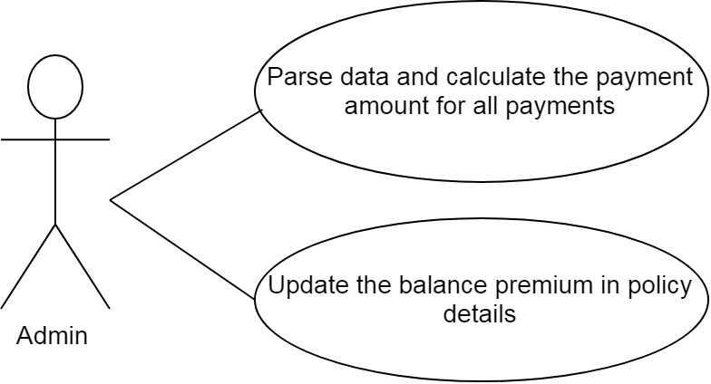
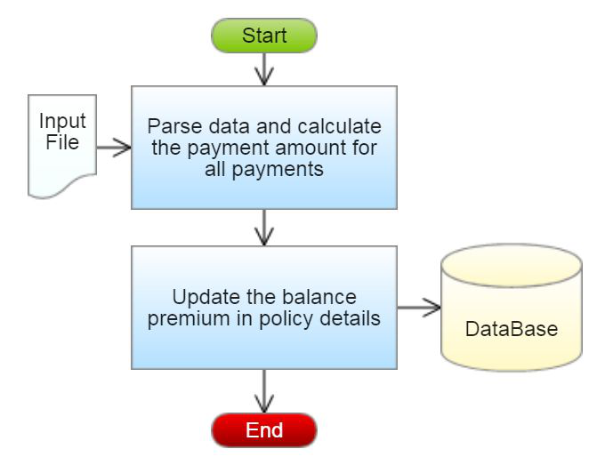
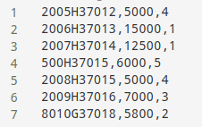

# WeCare Health Insurance

## Introduction

WeCare is a health insurance agency which provides various insurance policies. Each policy has its own policy Id, duration in years and total coverage amount. WeCare has collection agents who collect the monthly premium of the policies at the door step of their customers. So, at the end of each day, they need to manually calibrate and update the account details in their database. To make this updating process easier, WeCare wants to automate it. Help them by automating the process of Health Insurance Payment. 

The WeCare insurance agency has the following business processes that must be automated.

1. Parse data and calculate the payment amount for all the payments
2. Update the balance premium in policy details

## Functional Requirement

| Req. Name | Req. Description | Actors / Users | Comments |
| --------- | ---------------- | -------------- | -------- |
| Parse data and calculate the payment amount for all the payments | The policy details like policy Id, monthly premium, number of months for each payment are stored in a flat file. Retrieve the data from the file and calculate the payment amount based on the monthly premium and the number of months for each payment. | Admin | The admin of  WeCare is responsible for parsing the data and calculating the payment amount for all the payments. |
| Update the balance premium in the policy details | The policy details including policy Id, total coverage, balance premium and premium duration in years of each policy are stored in the database. WeCare needs to update the balance premium which holds the remaining amount to be paid for completing the total coverage of each policy, in the database, based on the calculated payment amount with respect to the policy Id. | Admin | The admin of WeCare is responsible for updating the balance premium of each policy, which holds the remaining amount to be paid for completing the total coverage, in the database. |

### Use Case Diagram

### System Architechture Diagram

## Design Specification

### Data Desing

> Table Structure

<table>
<caption>Table Name : Policy_Details</caption>
<thead>
<tr>
<th>Column Name</td>
<th>Data Type</th>
</tr>
</thead>
<tbody>
<tr>
<td>policy_id</td>
<td>varchar(25)</td>
</tr>
<tr>
<td>total_coverage</td>
<td>double</td>
</tr>
<tr>
<td>balance_premium</td>
<td>double</td>
</tr>
<tr>
<td>premium_duration_years</td>
<td>int</td>
</tr>
</tbody>
</table>

>Design Constraints

Use MYSQL database to store the data. The database name should be “InsurancePolicy”.

The above table has been created already. To create the table in your local machine, you can avail the script from “script.sql, which will be provided as part of the code skeleton.

The table names and the column names should be the same as specified in the table structure.

Database connections should be configurable; it should not be hard coded. The database information is specified in the “**db.properties**” file, which is also provided as part of the code skeleton.

### Component Design for identified use cases

#### Parse data and calculate the payment amount for all payments

The policy payment details like policy Id, monthly premium and number of months for each payment are stored in a flat file. Retrieve the data from the file and calculate the amount based on the monthly premium and the number of months for each payment. The list of the all the policy payment details with the above mentioned details are stored in a file named **PolicyPaymentDetails.txt**.

Sample file containing package details is shown below. The file is comma delimited.

[PolicyPaymentDetailsFormat:policyId,monthlyPremium,noOfMonths]

From the PolicyPaymentDetails.txt file, read the details, parse the data and construct a Payment object for each record in the file, then calculate the payment amount for each payment based on the conditions given below and set the payment amount.

| No of Months | Penalty Percentage on the Payment Amount |
| ------------ | ---------------------------------------- |
| 1 | 0% (No penalty) |
| > 1 and <= 5 | 3% |
| > 5 and <= 12 | 5% |
| > 12 | 7% |

The payment Amount should be calculated based on the monthly Premium and the no of months. The penalty should be calculated depending on the no of months the payment is due and it should be deducted from the payment amount. After reducing the penalty, set the final value to the payment amount. 

    Amount = (monthly Premium*no of Months)
    paymentAmount=Amount-(Amount*penaltyPercentage/100)

**For example**: 

If a payment has a monthly premium of Rs. 5000 and the number of months as 4, then the payment amount will be (5000*4) which is 20000.00. Since the number of months is 4, the penalty percentage will be 3%. 

Therefore, the penalty will be (20000.0*(3/100)) which is Rs. 600.00. Therefore, the payment amount for this payment will be((5000*4)-600.0) which is Rs.19400.00.

After calculating the payment amount for each payment, store the payment object into a list.

**Validation**:

The policyId should be validated before calculating the payment amount and adding it to the list. 

The policyId should be in the following format:

1. The policyId should contain exactly 10 characters
2. The fifth character must be an alphabet “H” in upper-case only.

If the policyId is valid then parse the data and calculate the payment amount else throw a user defined Exception “InvalidPolicyIdException” with a message "Invalid Policy Id".

> Component Specification: Payment(model class)

| Component Name | Type(Class) | Attributes	Methods |
| -------------- | ----------- | ------------------ |
| Parse data and calculate the payment amount for all the payments | Payment | String policyId double monthlyPremium int noOfMonths double paymentAmount | Include getters and setters method for all the attributes. |

> Component Specification: Payment(model class)

| Component Name | Type(Class) | Methods | Responsibilities |
| -------------- | ----------- | ------- | ---------------- |
| Parse data and calculate the payment amount for all the payments | Payment | void calculatePaymentAmount() | This method should calculate and set the payment amount based on the monthly Premium and no of Months for each payment. |

>CollectionAgency(utility class)

| Component Name | Type(Class) | Method | Responsibilities | Exception |
| -------------- | ----------- | ------ | ---------------- | --------- |
| Parse data and calculate the payment amount for all the payments | Collection Agency | `List<Payment>generatePaymentAmount(String filePath)` | This method should take the file path as argument and it should parse the data stored in the file and it should validate the policy Id by invoking the validate(String policyId) method, if valid, construct a Payment object for each record in the file, and then calculate the payment amount by invoking the calculatePaymentAmount method of Payment class. After calculating the payment amount, each Payment should be added to the list and this method should return the list of Payment. |
| Parse data and calculate the payment amount for all the payments | CollectionAgency | `boolean validate(String policyId)` | This method should validate the policyId, if valid return true else this method should throw an user-defined exception | Throw a user defined exception “InvalidPolicyIdException” if the policyId is invalid. |

**Note**: The data file will contain both valid and invalid details. Valid payment details should be added to the list and for the invalid ones user defined exception should be thrown.

#### Update the balance premium in policy details 

The policy details including policy Id, total coverage, balance premium and premium duration in years for each policy are stored in the database. WeCare needs to update the balance premium which holds the remaining amount to be paid for completing the total coverage of each policy, in the database, based on the calculated payment amount with respect to the policy Id.

> Component Specification: CollectionAgency(utility class)

| Component Name | Type(Class) | Method | Responsibilities | Resources |
| -------------- | ----------- | ------ | ---------------- | --------- |
| Update the balance premium in the policy details | CollectionAgency |	`void updatePolicyDetails(List<Payment>paymentList)` | This method should update the balance_premium by reducing the existing value with the calculated payment amount in the Policy_Detailstable.  Assume that the balance_premium will be greater than or equal to calculated payment amount.
Connect to the database by invoking the establishConnection() method of DBHandler class. | MYSQL database is used. Update the balancd_premium in the Policy_Details table. |

> DBHandler(DAO class)

| Component Name | Type(Class) | Method | Responsibilities | Resources |
| -------------- | ----------- | ------ | ---------------- | --------- |
| Update the balance premium in the policy details | DBHandler | `Connection establishConnection()` | This method should connect to the database by reading the database details from the db.properties file and it should return the connection object | MYSQL database is used. Store and retrieve the details into/from Policy_Details table. db.properties file is used to store the database configuration details. |