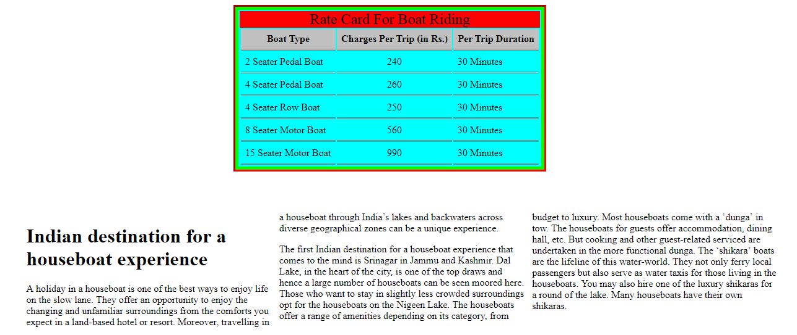

# Rate Card For Boat Riding

A Boat House wants their Boat Riding Rate Card Online for the public. They also want to apply Styling to the Boat Riding Rate Card.

The following is the screenshot of the Rate Card for Boat Riding

Use the CSS Selectors with the given Properties and Values.

Provide the details as given in the table below.

| CSS Selectors | Properties And Values | 
| ------------- | --------------------- |
| ratecard | display should be “block” border width should be “5px” border style should be “solid” border color should be “#00FF00” outline style should be “inset” outline color should be “#FF0000” background color should be “#00FFFF” padding should be “2px” margin top should be “2%” margin left should be “30%” width should be “485px” height should be “250px” text align should be “justify”  |
| td | padding should be “7px” border bottom style should be “double” border color should be “#808080” |
| caption | background color should be “red” font size should be “x-large” |
| th | background color should be “silver” padding should be “7px” border bottom style should be “double” border color should be “#808080” text should be aligned to the “center” of the page |
| col2 | text should be aligned to the “center” of the page |
| container | column count should be “3” column width should be “100px” column gap should be “10px” margin should be “5%” | 

