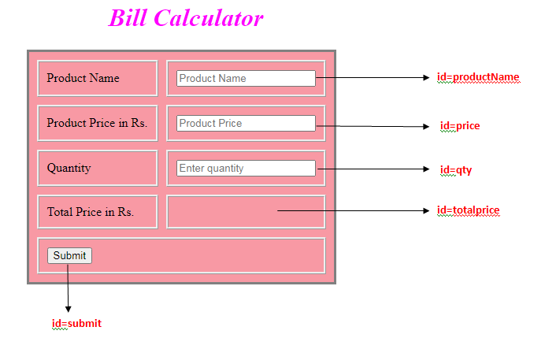
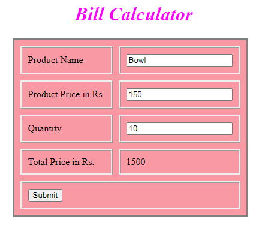

# Bill Calculator

Bill Calculator

A Grocery Shop requires an application for Bill Calculation. The person generating the bill is supposed to enter the product details. Using the output tag, the total price is displayed.

The following are the screenshots of the Bill Calculator
 

Use the Label Name and the Component Id as given. The Component Id can be given in any case (Upper case or Lower case or Mixed case).All the necessary attributes for the Components should be given.

The Component Id should be specified for each HTML Component. If the Component Id is not provided for an HTML component, marks will not be provided for that component.

All Tags, Elements and Attributes should conform to HTML5 Standards. All the fields are mandatory.

Provide the details as given in the table below. 

<table>
<thead>
<tr>
<th>Req. Name</th>
<th>Req. Description</th>
</tr>
</thead>
<tbody>
<tr>
<td>Design a Web page “Bill Calculator” with the specified fields.</td>
<td>
<table>
<thead>
<tr>
<th>Label Name</th>
<th>Component  Id Specify it for the “id” attribute)</th>
<th>Description</th>
</tr>
</thead>
<tbody>
<tr>
<td>Product Name</td>
<td>productName</td>
<td>To enter the product name. Design Constraints: Use type=”text”. The text “Product Name” should appear by default. It is mandatory.</td>
</tr>
<tr>
<td>Product Price in Rs.</td>
<td>price</td>
<td>To enter the price of the product. Design Constraints: Use type=”number”. The text “Product Price” should appear by default. It is mandatory.</td>
</tr>
<tr>
<td>Quantity</td>
<td>qty</td>
<td>To enter the product quantity. Design Constraints: Use type=”number”. The text “Enter quantity” should appear by default. Assume that the min value is “1”. It is mandatory.</td>
</tr>
<tr>
<td>Total Price in Rs.</td>
<td>totalprice</td>
<td>To display the total price of the product. Design Constraints: Use output tag. It is mandatory.</td>
</tr>
<tr>
<td>Submit</td>
<td>submit</td>
<td>The input type submit must be used.</td>
</tr>
</tbody>
</table>
<strong>NOTE</strong>: The text highlighted in bold in the Description needs to be implemented in the code to complete the web page design.</td>
</tr>
<tr>
<td>form  Tag  with attribute onsubmit</td>
<td>form Tag is already given in the code template. Do not change the code template and do the coding as per the requirements and specifications. Make sure that the onsubmit attribute in the form tag invokes the JavaScript function like &quot;return calculateTotalPrice()&quot;. Also ensure that the “return false;” statement is the last line of the JavaScript function “calculateTotalPrice()”.</td>
</tr>
</tbody>
</table>

