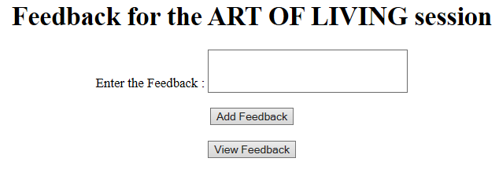
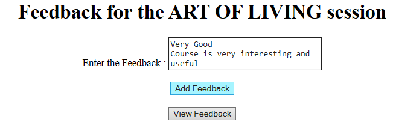
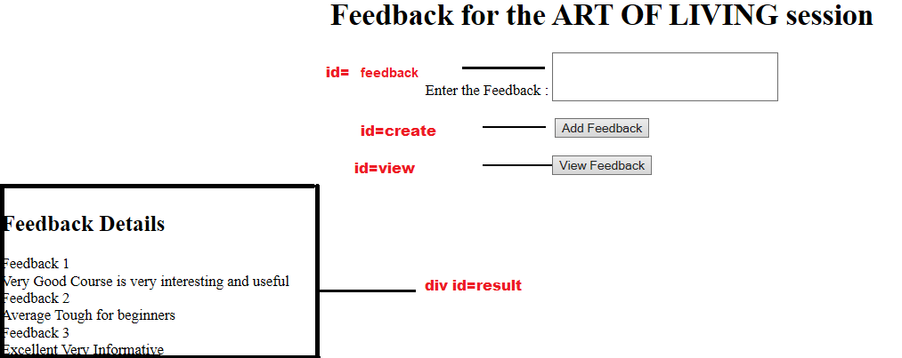

# FeedBack Details

Get the feedback details from the user and add it to an array. Display the feedback details in the format as shown in the screenshot.

## Problem Specification:

1. File name should be index.html.
2. Create an external script file named script.js.
3. Use h2 tag for the title of Feedback Details.
4. Display all the feedbacks followed by a new line separator after printing the above title.
5. Refer Sample screenshot for more specifications.
6. Include the script file in html page.
7. The "Add Feedback" button will add the feedback details to an array.
8. The "View Feedback" button will display all the feedbacks (multiple feedbacks) in the format as shown in the screenshot in the result div.
9. Include the below functions/methods in the java script file

| Function Name | Description |
| ------------- | ----------- |
| `addFeedback()` | It is used to add the feedback details to an array. After clicking the Add Feedback button, clear the text area and display the response message as "Successfully Added Feedback Details!". |
| `displayFeedback()` | It is used to display the feedback details. After displaying the feedback details clear the array. |

> Sample Input/Output:

### Screen 1:

### Screen 2: 

### Screen 2.1:

### Screen 3:

