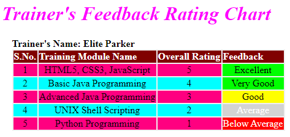

# Trainer's Feedback Rating Chart

Learning Partner Training Company wants to send Trainer’s Feedback every month to the trainers. They also want to apply Styling to the Trainer Feedback Rating Chart.

The following is the screenshot of the Trainer Feedback Rating Chart

 
Use the CSS Selectors with the given Properties and Values.
Provide the details as given in the table below.

| CSS Selectors | Properties And Values |
| ------------- | --------------------- |
| h1 | text should be aligned to the “center” of the page color should be “#FF00FF” font style should be “italic” |
| table | text should be aligned to the “left” of the page margin left should be “35%” background color should be “#F0F0F0” |
| td | text should be aligned to the “center” of the page |
| caption | text should be aligned to the “left” of the page font should be displayed in “bold” |

- Set background color of component with class tr1 as : #ff0080
- Set background color of component with class theader as : #800000
- Set background color of component with id ex1 and vg1 as : #00ff00
- Set background color of component with id go1 as : #ffff00
- Set background color of component with id av1 as : #d3d3d3
- Set color of component with id av1 as : #ffffff
- Set background color of component with id bal as : #ff0000
- Set color of component with id bal as : #ffffff
