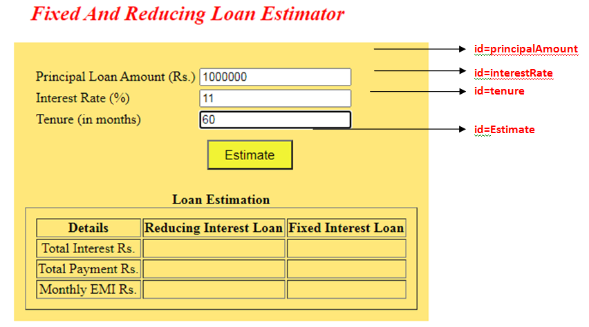
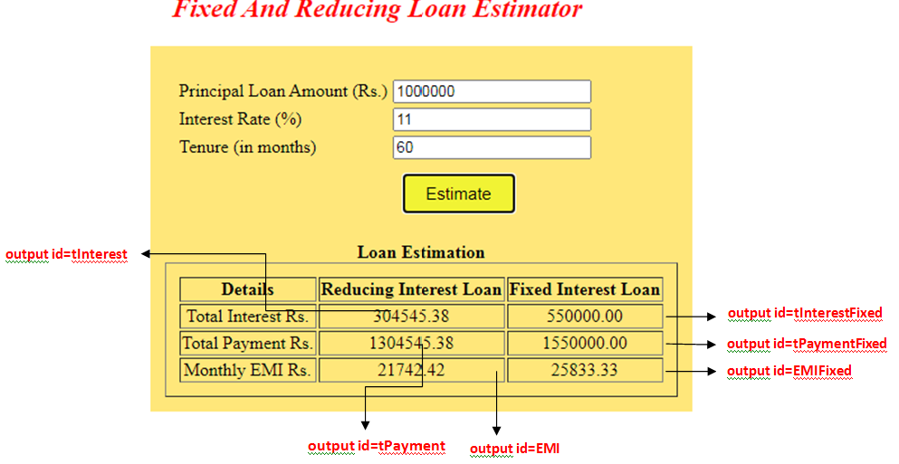

# Fixed and Reducing Interest Loan Estimator

Fixed And Reducing Interest Loan Estimator
The Olympus Bank requires a Fixed and Reducing Interest Loan Estimator for the ease of it’s customers. The customers are asked to fill a form regarding their loan details. The customers can know about the Total Payment, Total Interest and the Monthy EMI to be paid for the loan taken based on both the Fixed and Reducing Interest.

The following are the screenshots for Fixed And Reducing Interest Loan Estimator

         

Use the Label Name and the Component Id as given. The Component Id can be given in any case (Upper case or Lower case or Mixed case).All the necessary attributes for the Components should be given.

The Component Id should be specified for each HTML Component. If the Component Id is not provided for a HTML component, the marks will not be provided for this component.

All Tags, Elements and Attributes should conform to HTML5 Standards. All the fields are mandatory.

Provide the details as given in the table below.

<table>
<thead>
<tr>
<th>Req. Name</th>
<th>Req. Description</th>
</tr>
</thead>
<tbody>
<tr>
<td>Design a Web page “Fixed And Reducing Loan Estimator” with the specified fields.</td>
<td>
<table>
<thead>
<tr>
<th>Label Name</th>
<th>Component  Id (Specify it for the “id” attribute)</th>
<th>Description</th>
</tr>
</thead>
<tbody>
<tr>
<td>Principal Loan Amount (Rs.)</td>
<td>principalAmount</td>
<td>To enter the principal amount for the loan. Design Constraints: The text “Principal Amount” should appear by default.  It should be mandatory.</td>
</tr>
<tr>
<td>Interest Rate (%)</td>
<td>interestRate</td>
<td>To enter the interest rate percentage. <strong>Design Constraints:</strong> The text “Interest Per Annum” should appear by default. <em>It should be mandatory.</em></td>
</tr>
<tr>
<td>Tenure (in months)</td>
<td>tenure</td>
<td>To enter the tenure in months. <strong>Design Constraints</strong>: The text “Tenure in Months” should appear by default. It should be mandatory.</td>
</tr>
<tr>
<td>Estimate</td>
<td>Estimate</td>
<td>The input type button must be used.</td>
</tr>
</tbody>
</table>
<strong>NOTE</strong>: The text highlighted in bold in the Description needs to be implemented in the code to complete the web page design.</td>
</tr>
<tr>
<td>Use JavaScript for displaying the calculated EMI, Total Payment and Total Interest for both the Fixed And Reducing Loan Interest</td>
<td>Use JavaScript for displaying the calculated EMI, Total Payment and Total Interest for both the Fixed And Reducing Loan Interest When the customer enters the valid values and clicks the “Estimate” button, the Reducing Interest Loan is displayed as  follows: The result should be displayed as <strong>“totalInterest”</strong> in a output tag with  id  “tInterest”. <strong>“totalPayment”</strong> in a output tag with  id  “tPayment”.  <strong>“EMI”</strong> in a output tag with  id  “EMI”. The Fixed Interest Loan is displayed as follows: <strong>“totalInterest”</strong> in a output tag with  id  “tInterestFixed”. <strong>“totalPayment”</strong> in a output tag with  id  “tPaymentFixed”. <strong>“EMI”</strong> in a output tag with  id  “EMIFixed”. <strong>Note</strong>: Use the getElementsByName() or getElementById()  function to retrieve the values.</td>
</tr>
<tr>
<td>form  Tag  with attribute onsubmit</td>
<td>form Tag is already given in the code template. Do not change the code template and do the coding as per the requirements and specification. Make sure that the onclick attribute in the buttoncomponent with id=”Estimate” is invoking the JavaScript function like “EstimateReducingInterestLoan ()&quot;. For the Reducing Interest Loan: The EMI is calculated using the following formulae: EMI = P <em> R </em> ((1 + R) ^ N / ((1 + R) ^ N - 1)) where P -&gt; Principal amount R -&gt; rate of interest per month = (r / 100) / 12 r -&gt; rate of Interest per annum, N -&gt; tenure in months. Use toFixed() function to display only two numbers after the decimal point in the calculated EMI.For Example, the EMI is calculated as follows: P = Rs. 1,00,000 r = 10%  R = (10 / 100) / 12 N = 24 months  EMI is Rs.4614.49 The Total Payment is calculated using the following formulae: totalPayment = EMI <em> tenure_months The Total Interest is using the following formulae: totalInterest = totalPayment – principalAmount For the Fixed Interest Loan: The Total Interest is using the following formulae: totalInterest =  principalAmount </em> interestRate/100 <em> tenure_years The Total Payment is calculated using the following formulae: totalPayment = principalAmount + totalInterest The EMI is calculated using the following formulae: EMI = totalPayment / (tenure_years </em> 12) Use toFixed() function to display only two numbers after the decimal point in the totalInterest, totalPayment and the calculated EMI.</td>
</tr>
</tbody>
</table>
