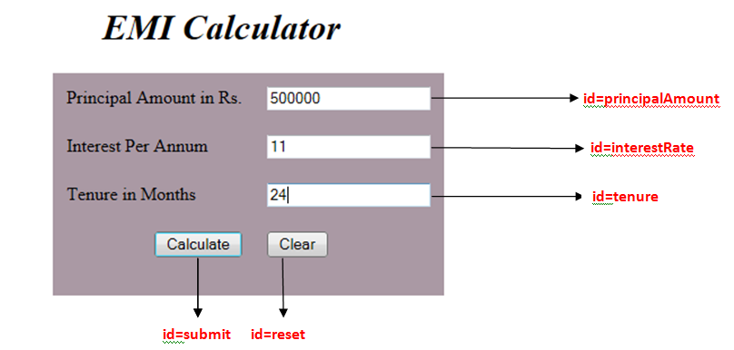
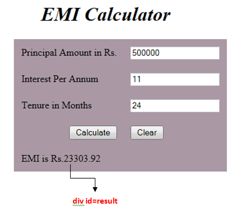

# EMI Calculator

The Silver Bank requires a EMI Calculator for the ease of it’s customers. The customers are asked to fill a form regarding their EMI details. The customers can know about the EMI to be paid per month for the loan taken.

The following are the screenshots for EMI Calculator      

               

                    
Use the Label Name and the Component Id as given. The Component Id can be given in any case (Upper case or Lower case or Mixed case).All the necessary attributes for the Components should be given.

The Component Id should be specified for each HTML Component. If the Component Id is not provided for a HTML component, the marks will not be provided for this component.

All Tags, Elements and Attributes should conform to HTML5 Standards. All the fields are mandatory.

Provide the details as given in the table below.

<table>
<thead>
<tr>
<th>Req. Name</th>
<th>Req. Description</th>
</tr>
</thead>
<tbody>
<tr>
<td>Design a Web page “EMI Calculator” with the specified fields.</td>
<td>
<table>
<thead>
<tr>
<th>Label Name</th>
<th>Component  Id (Specify it for the “id” attribute)</th>
<th>Description</th>
</tr>
</thead>
<tbody>
<tr>
<td>Principal Amount in Rs.</td>
<td>principalAmount</td>
<td>To enter the principal amount. <strong>Design Constraints:</strong> It should be a numeric field. The text “Principal Amount” should appear by default. <em>It should be mandatory.</em></td>
</tr>
<tr>
<td>Interest Per Annum</td>
<td>interestRate</td>
<td>To enter the interest rate percentage. <strong>Design Constraints</strong>: It should be a numeric field. The text “Interest Per Annum” should appear by default. <em>It should be mandatory.</em></td>
</tr>
<tr>
<td>Tenure in Months</td>
<td>tenure</td>
<td>To enter the tenure in months. <strong>Design Constraints:</strong> It should be a numeric field. The text “Tenure in Months” should appear by default. <em>It should be mandatory.</em></td>
</tr>
<tr>
<td>Calculate</td>
<td>submit</td>
<td>The input type submit must be used.</td>
</tr>
<tr>
<td>Clear</td>
<td>reset</td>
<td>Reset Button.  On clicking this button, all fields should be reset.</td>
</tr>
</tbody>
</table>
<strong>NOTE</strong>: The text highlighted in bold in the Description needs to be implemented in the code to complete the web page design.</td>
</tr>
<tr>
<td>Use JavaScript for displaying the calculated EMI</td>
<td>Use JavaScript for displaying the  calculated EMI: When the customer enters the valid values and clicks the “Submit” button, the  calculated EMI Amount is displayed as follows: The result should be displayed as “EMI is Rs. EMI” in a div tag with id “result”. <strong>Note</strong>: Use the getElementsByName() or getElementById() function to retrieve the values.</td>
</tr>
<tr>
<td>form  Tag  with attribute onsubmit</td>
<td><strong>form</strong> Tag is already given in the code template. Do not change the code template and do the coding as per the requirements and specification. Make sure that the onsubmit attribute in the form tag is invoking the JavaScript function like &quot;return calculateEMI()&quot;. Also ensure that “return false;” statement is the last line of the JavaScript function “calculateEMI()”. The EMI is calculated using the following formulae: EMI = P <em> R </em> ((1 + R) ^ N / ((1 + R) ^ N - 1)) where P -&gt; Principal amount R -&gt; rate of interest per month = (r / 100) / 12 r -&gt; rate of Interest per annum N -&gt; tenure in months. Use toFixed() function to display only two numbers after the decimal point in the calculated EMI. For Example, the EMI is calculated as follows: P = Rs. 1,00,000 r = 10%  R = (10/100) / 12 N = 24 months EMI is Rs.4614.49</td>
</tr>
</tbody>
</table>
